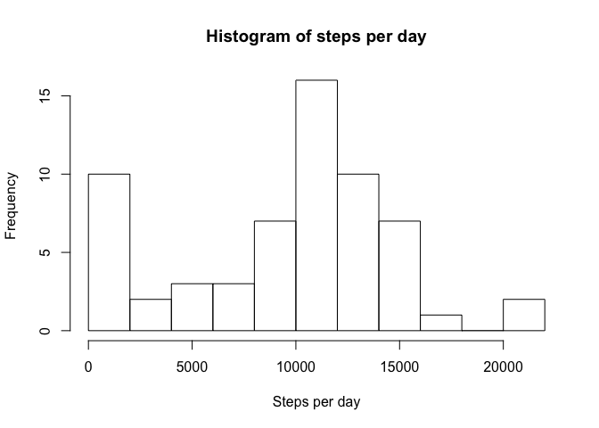

## Loading and preprocessing the data

Unzip file and load dataset


```r
unzip("activity.zip")
df <- read.csv("activity.csv")
```

Load required libraries

```r
library(ggplot2)
```


## What is mean total number of steps taken per day?

1. Calculate the total number of steps taken per day
2. Make a histogram of the total number of steps taken each day
3. Calculate and report the mean and median of the total number of steps taken per day


```r
steps_per_day <- sapply(with(df, split(steps, date)), sum, na.rm=TRUE)
hist(steps_per_day, breaks = 10, xlab = "Steps per day", main = "Histogram of steps per day")
```

<!-- -->

```r
mean_steps <- mean(steps_per_day, na.rm = TRUE)
median_steps <- median(steps_per_day, na.rm = TRUE)
```


```r
mean_steps
```

```
## [1] 9354.23
```

```r
median_steps
```

```
## [1] 10395
```

Mean steps per day is 9354.2295082 and median steps per day is 10395.

## What is the average daily activity pattern?
1. Make a time series plot of the 5-minute interval (x-axis) and the average number of steps taken, averaged across all days (y-axis)
2. Which 5-minute interval, on average across all the days in the dataset, contains the maximum number of steps?


```r
steps_per_interval <- sapply(with(df, split(steps, interval)), mean, na.rm=TRUE)
plot(steps_per_interval, xlab = "Interval", ylab = "Average steps in interval", type = "l")
```

<!-- -->

```r
max_index <- which.max(steps_per_interval)
max_index
```

```
## 835 
## 104
```

The 5 minute interval with maximum number of steps on average is 104.


## Imputing missing values

1. Calculate and report the total number of missing values in the dataset (i.e. the total number of rows with NAs)
2. Devise a strategy for filling in all of the missing values in the dataset.
3. Create a new dataset that is equal to the original dataset but with the missing data filled in.
4. Make a histogram of the total number of steps taken each day and Calculate and report the mean and median total number of steps taken per day. Do these values differ from the estimates from the first part of the assignment? What is the impact of imputing missing data on the estimates of the total daily number of steps?

Strategy: Use mean for the 5-minute interval.


```r
na_summary <- sapply(df, function(x) sum(length(which(is.na(x)))))
na_summary
```

```
##    steps     date interval 
##     2304        0        0
```

Missing values for for steps column. The number of missing values is 2304.

Create new dataset and replace missing values.

```r
df1 <- df
# If no number of steps is missing, use average for interval.
for (i in 1:dim(df1)[1]) {
        if (is.na(df1[i, 1])) {
                iv <- df1[i, 3]
                df1[i, 1] <- steps_per_interval[as.character(iv)]
        }
}
```

Histogram

```r
steps_per_day_clean <- sapply(with(df1, split(steps, date)), sum)
hist(steps_per_day_clean, breaks = 10, xlab = "Steps per day", main = "Histogram of steps per day")
```

<!-- -->

Mean and median

```r
mean_steps_clean <- mean(steps_per_day_clean)
median_steps_clean <- median(steps_per_day_clean)
```

```r
mean_steps_clean
```

```
## [1] 10766.19
```

```r
median_steps_clean
```

```
## [1] 10766.19
```

Mean steps per day is 1.0766189\times 10^{4} and median steps per day is 1.0766189\times 10^{4}. Data for some days is completely missing, hence in order to use them in the analysis they must be defined.


## Are there differences in activity patterns between weekdays and weekends?
1. Create a new factor variable in the dataset with two levels – “weekday” and “weekend” indicating whether a given date is a weekday or weekend day.
2. Make a panel plot containing a time series plot (i.e. type="l") of the 5-minute interval (x-axis) and the average number of steps taken, averaged across all weekday days or weekend days (y-axis).

New factor variable

```r
df1$weekdaytype <- "weekday"
df1$weekdaytype[weekdays(as.Date(df1$date)) %in% c("Saturday", "Sunday")] <- "weekend"
```
Calculate step mean for each interval and weekday type combination.


```r
steps_per_interval_and_weekdaytype <- aggregate(steps ~ interval + weekdaytype, data = df1, mean)
```

Plot time series

```r
ggplot(steps_per_interval_and_weekdaytype, aes(interval, steps)) + geom_line() + facet_grid(weekdaytype ~ .) + xlab("Interval") + ylab("Average steps in interval")
```

<!-- -->
